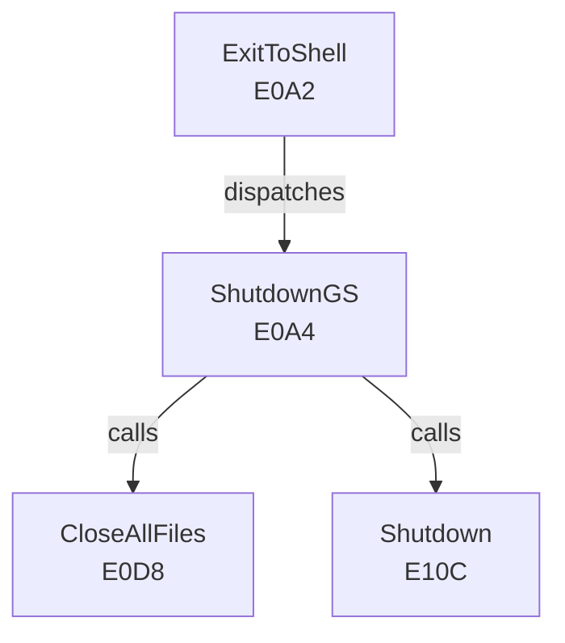

# Clean-Room Deconstruction Methodology

This document defines the standards and tooling for public deconstruction of GS/OS and the Apple IIGS ecosystem. The goal is education and research — publishing what we learned without redistributing what we copied.

## Publication Boundaries

### What We Publish

- Annotated callgraphs (as Mermaid diagrams or structured DOT formats in markdown)
- Function-level behavioral models (decision tables, FSMs, dispatch layouts)
- Public-API signatures and calling conventions (from observation or Apple references)
- Register and memory maps derived from observation + public documentation
- Dispatch-table layouts and entry-point catalogs
- Instruction-level analysis of algorithms (without verbatim byte sequences)
- Our own net-new code (drivers, FSTs, system extensions, CDevs) written in ORCA/C

### What We Never Publish

- Disassembled bytes or decompiled source text from Apple binaries
- ROM image dumps or GS/OS factory source code
- Modifications to Apple-protected system binaries or files
- Reverse-engineered bytecode or raw machine code from copyrighted software
- Complete reconstructions of Apple intellectual property

## Toolchain and Instruments

### Primary: Ghidra (Static Analysis)

Ghidra is the NSA-developed, open-source disassembler and decompiler. The community-maintained 65816 SLEIGH processor module (search GitHub for `ghidra 65816`) is the canonical module for Apple IIGS binary analysis.

- **Install:** Follow the Ghidra README and SLEIGH processor documentation
- **Usage:** Load a GS/OS binary (`.SYS`, `.FST`, `.DRIVER`, or toolbox library) as a 65816 S16 object
- **Output:** Publish function signatures, control-flow graphs (as Mermaid), and annotated pseudocode (not decompiled source)
- **Headless:** Ghidra supports `-analyzed` batch mode for CI-integrated analysis and artifact generation

### Secondary: Capstone (Instruction Dissection)

Capstone is a lightweight disassembly engine. Use Capstone when byte-by-byte labeling or non-human-readable encoding analysis is required.

- **When:** Instruction-level detail (e.g., stack-frame management, addressing-mode sequences)
- **Output:** Annotated instruction tables; never republish raw opcode sequences without purpose

### Oracle: MAME `apple2gs` Driver (Dynamic Execution)

The MAME emulator's `apple2gs` driver is cycle-accurate. Use it for:

- Tracing execution of a specific code path (GS/OS kernel initialization, boot sequence)
- Observing memory layout and register state at breakpoints
- Verification of static analysis predictions

## Behavioral Observation Discipline

Every claim about GS/OS behavior must cite either:

1. **A public Apple reference** (Toolbox Reference, GS/OS Reference, Programmer's Reference, or a published Apple technical note)
2. **A behavioral observation traceable to a specific test** — document the test setup, input, execution environment, and observed output

Do not claim internal behavior of Apple code without evidence. Do not infer implementation from interface.

## Citation Standards

### For API Signatures and Calling Conventions

Example: "GS/OS toolbox call `$E0A2` (ExitToShell) expects A-register = 0x0000 and preserves all registers except for P and S."

Cite: "Apple IIGS Toolbox Reference, Vol. 2, Chapter: System Utilities, Section: ExitToShell."

### For Register and Memory Maps

Example: "The GS/OS kernel loads at $FE0000 in 24-bit address space. The interrupt vector table lives at $00000000–$000000FF."

Cite: Observation ("disassembled GS.OS via Ghidra with 65816 SLEIGH module, verified against MAME trace") or an Apple reference if available.

### For Control-Flow and Algorithm Description

Example: "The disk driver's read-sector routine performs a three-way dispatch on drive type (3.5", 5.25", hard drive) before issuing hardware commands."

Cite: "Observed in GS/OS driver binary via Ghidra callgraph analysis; corroborated with GSplus source code PR #X."

## Publication Format

### Callgraphs

Use Mermaid graph syntax. Example:

Publish as markdown in `docs/deconstruct/`.

### Behavioral Models

Use structured tables. Example:

| Condition | Register State | Kernel Action |
|-----------|----------------|---------------|
| Boot (reset) | A=0000, X=0000 | Load kernel into $FE0000 |
| Interrupt (IRQ) | Any | Context switch if multi-task pending |
| Abort (BRK) | Any | Vectored to breakpoint handler |

### Net-New Code

All driver and extension code lives in `tools/deconstruct/exemplars/` or `src/extensions/`. Full ORCA/C source, no disassembly.

## Verification and Review

Every deconstruction artifact is peer-reviewed before publication:

- Callgraphs: reviewed against Ghidra output and cross-checked against published interfaces
- Behavioral models: verified against observation in both Ghidra and MAME trace logs
- Net-new code: compiled with ORCA + Golden Gate, executed on emulator, CI-tested
- Citations: spot-checked against source (Apple reference, online archive, GitHub upstream)

## Related Governance

- Legal and ethical boundaries: `docs/deconstruct/legal-and-ethics.md`
- Unlock extension targets and API surfaces: `docs/deconstruct/unlock-targets.md`
- Toolchain setup: `docs/install-orca.md` and `docs/toolchain-paths.md`
